# Evalutating Single Object Tracking For Autonomous Driving

In this project, I applied and evaluated Single Object Tracking by using the object tracking system [SiamMask](https://github.com/foolwood/SiamMask) on the Audi Autonomous Driving Dataset [A2D2](https://www.a2d2.audi/a2d2/en.html) and [KITTI](http://www.cvlibs.net/datasets/kitti/).  
The goal was to test, how applicable SiamMask to the task of tracking individual vehicles in those datasets without explicitly fine-tuning it.  
For details see the whole [report](Report_SingleObjectTracking.pdf)

The GUI in this repository can be used to visualize the application of the tracker on the A2D2, see: 

<p align="center">
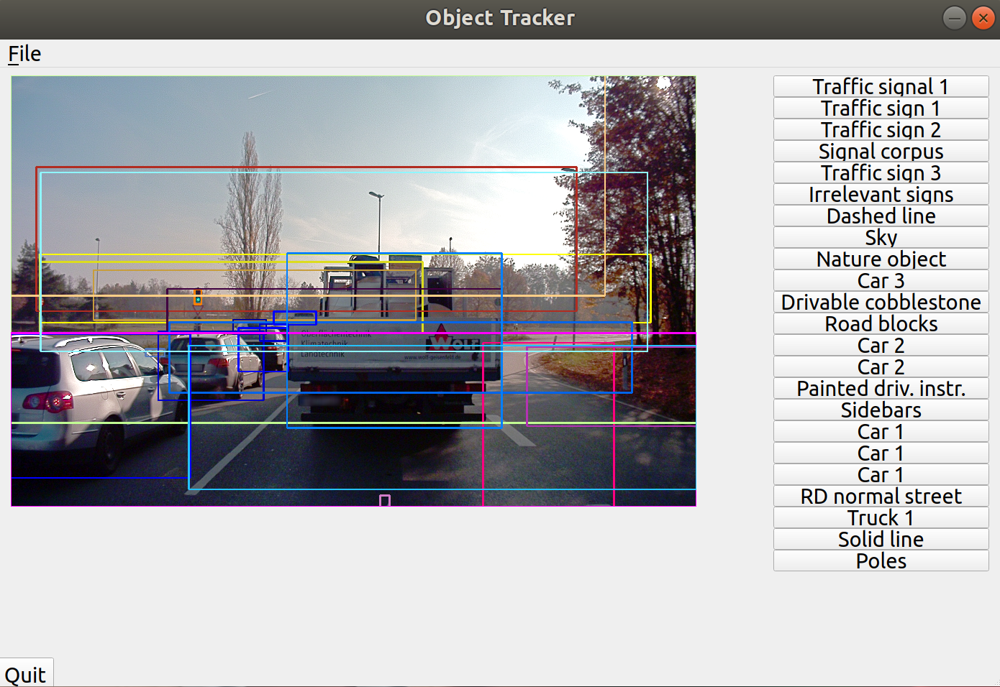 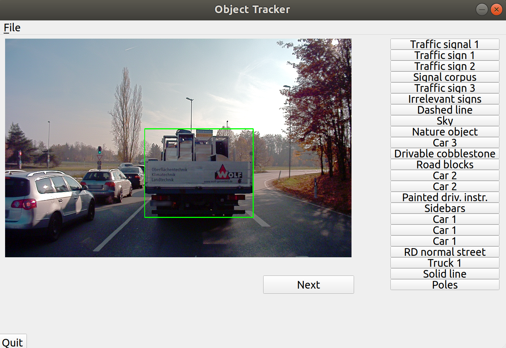
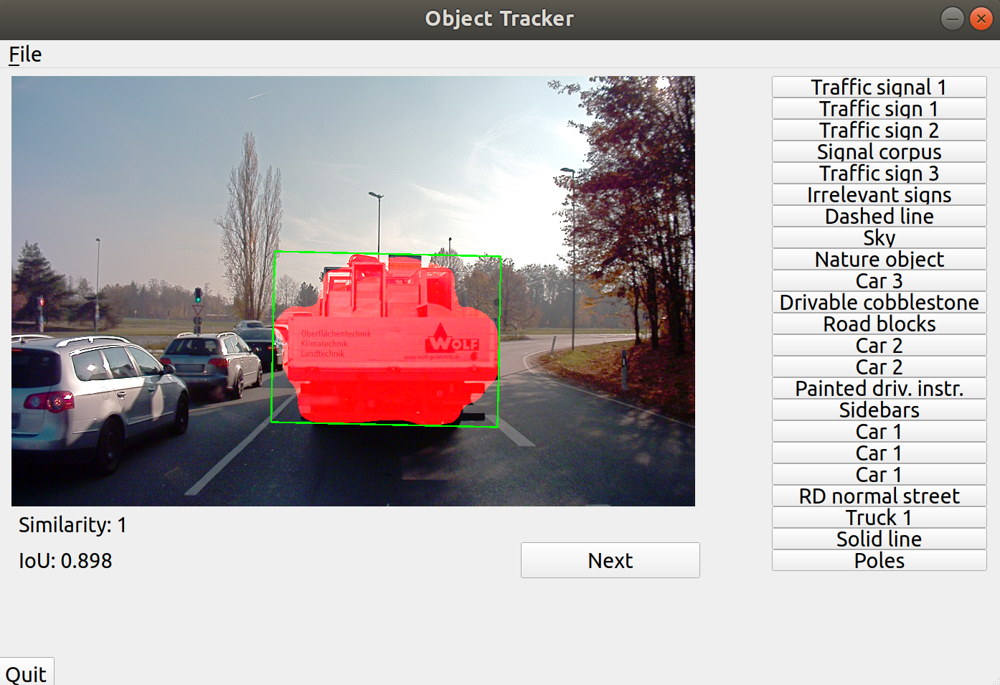

</p>

To download and install the repository follow the steps: 
* Download the project 
```
git clone https://github.com/samukie/SingleObjectTracking
cd SingleObjectTracking
```
* Setup the environment 
```
conda create -n sot 
conda activate sot
conda install pip opencv pyqt
pip install -r requirements.txt 
bash make.sh 
```
* [Download](https://www.a2d2.audi/a2d2/en/download.html) the desired subset of the A2D2
* Start the GUI 

```
cd evaluation
python GUI.py --config "../SiamMask/experiments/siammask_sharp/config_davis.json" \
--resume "../SiamMask/experiments/siammask_sharp/SiamMask_DAVIS.pth" --dataset "path/to/a2d2_root" \
--object_lookup "path/to/a2d2_class_list.json"
```

The tracker can be evaluated by using the humanly annotated semantic segmentation and instance segmentation images which were provided by human annotators: 

<p align="center">
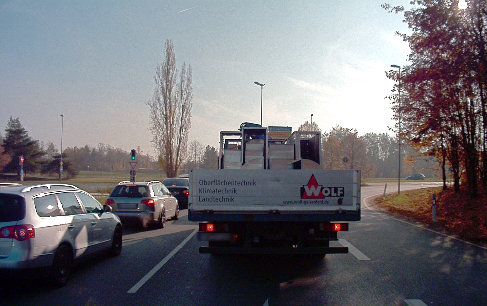 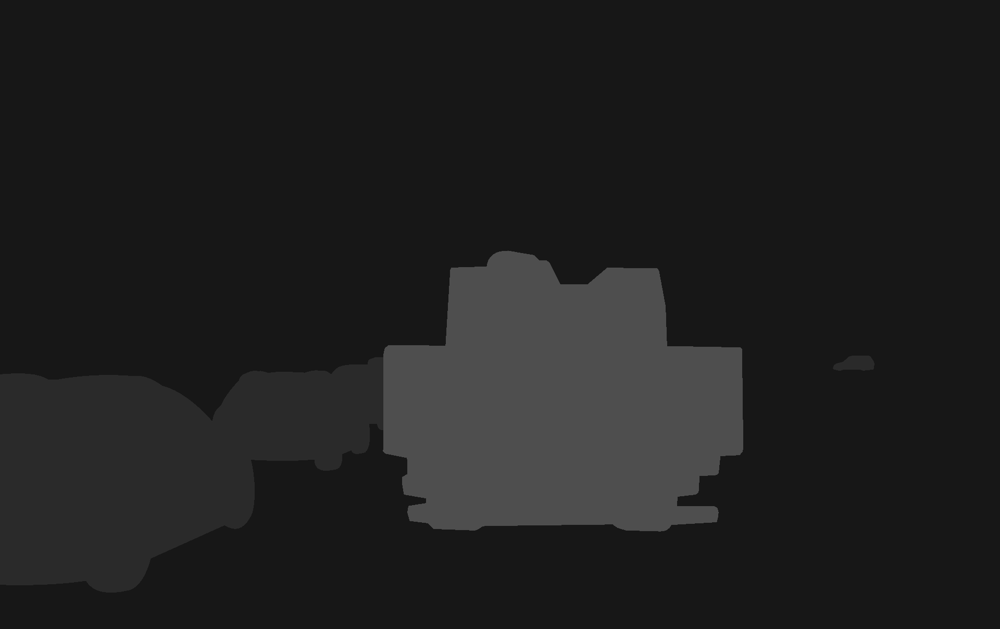 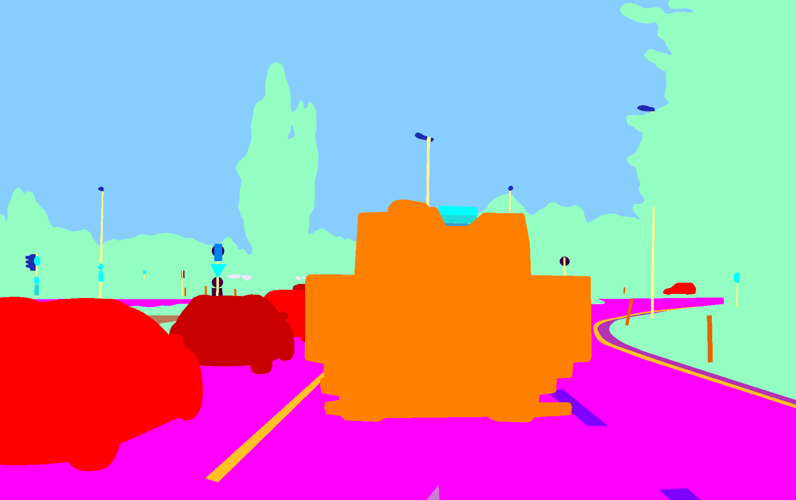
</p>

To evaluate SiamMask on the A2D2 or KITTI dataset, specify your own [config file](https://github.com/samukie/SingleObjectTracking/tree/main/configs) 
and execute: 

```
python evaluate_dataset.py --eval_config configs/you_config.yaml
```

There are two evaluation modes, the IoU and the end-of-track detection.  
In the A2D2, only a subset of the video frames is annotated with segmentations.
This leads to fail cases, where the tracker switches to other objects, if the gap between the scene displayed in two consecutive frames is too big:  

<p align="center">
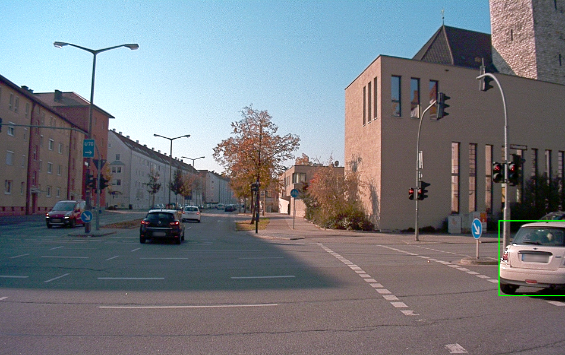 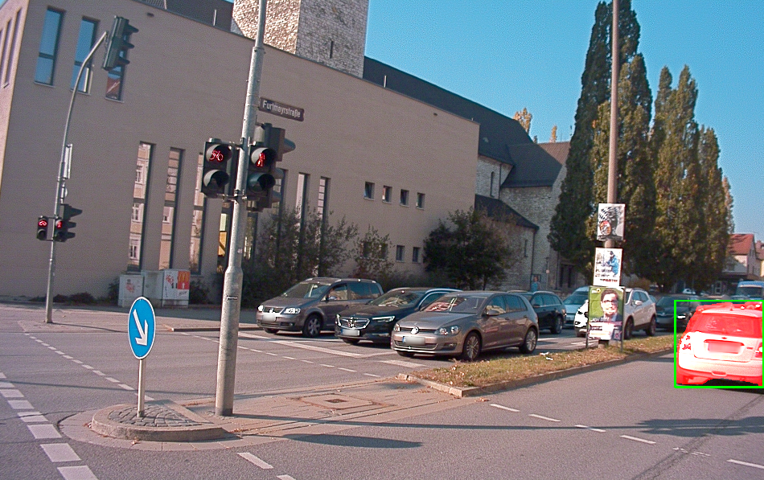 
</p>

This problem does not occur, when applying the tracker on the KITTI dataset: 

<p align="center">
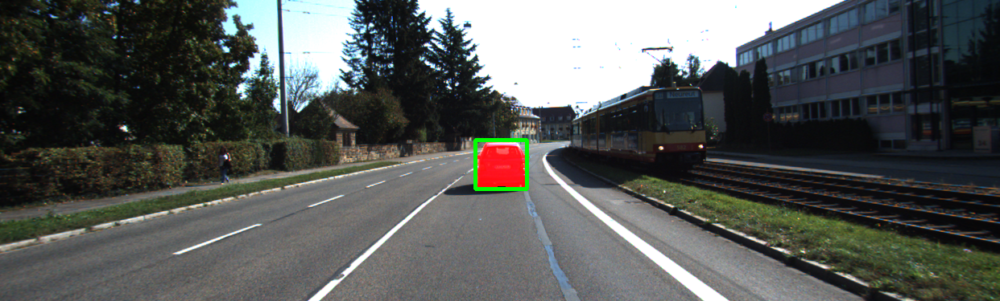 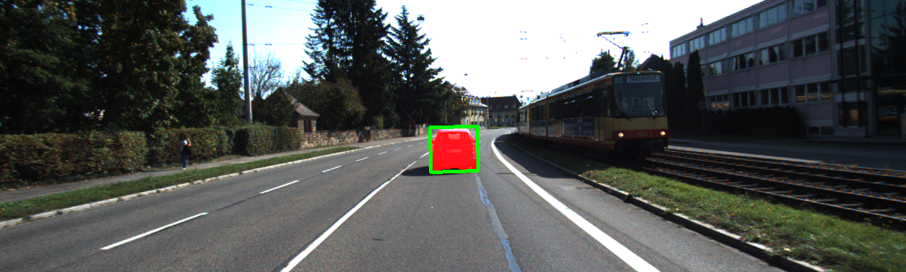 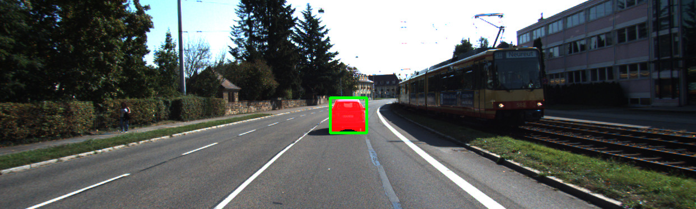
</p>

In this project, I tried to find similarity measures, such as using the internal similarity score of SiamMask, to predict, when the tracker fails, or the target object disappears from the scene:

<p align="center">
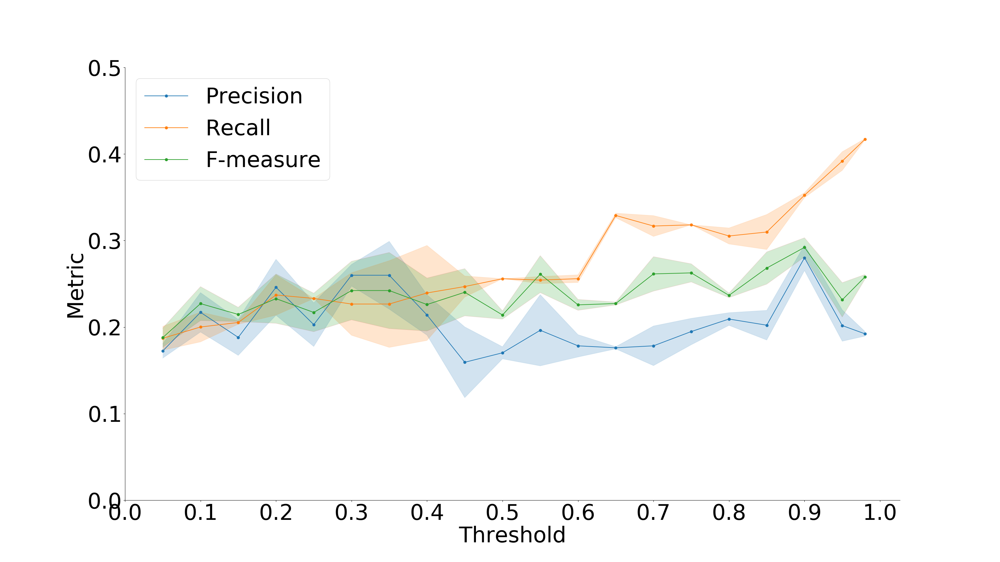 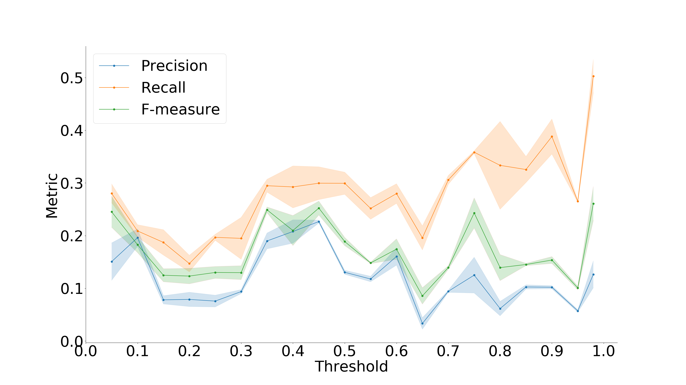
</p>
