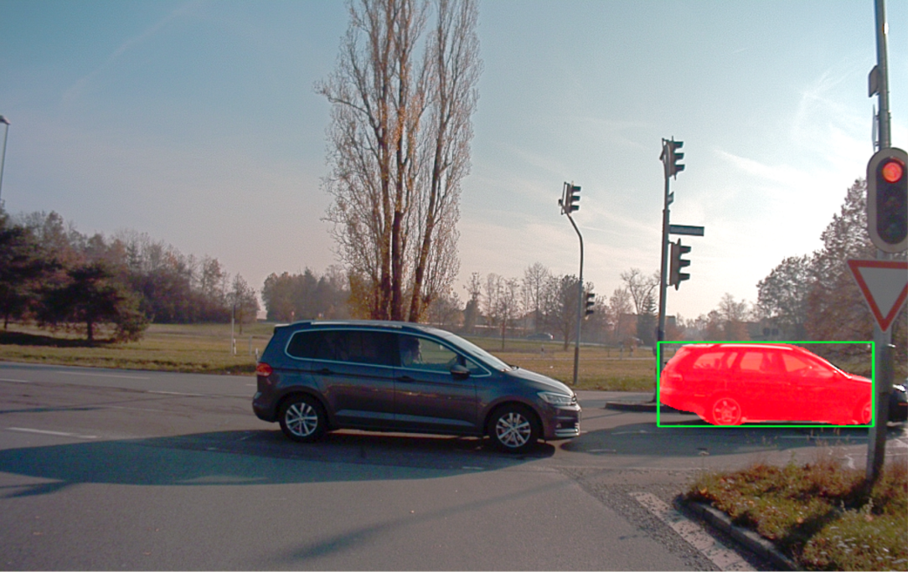
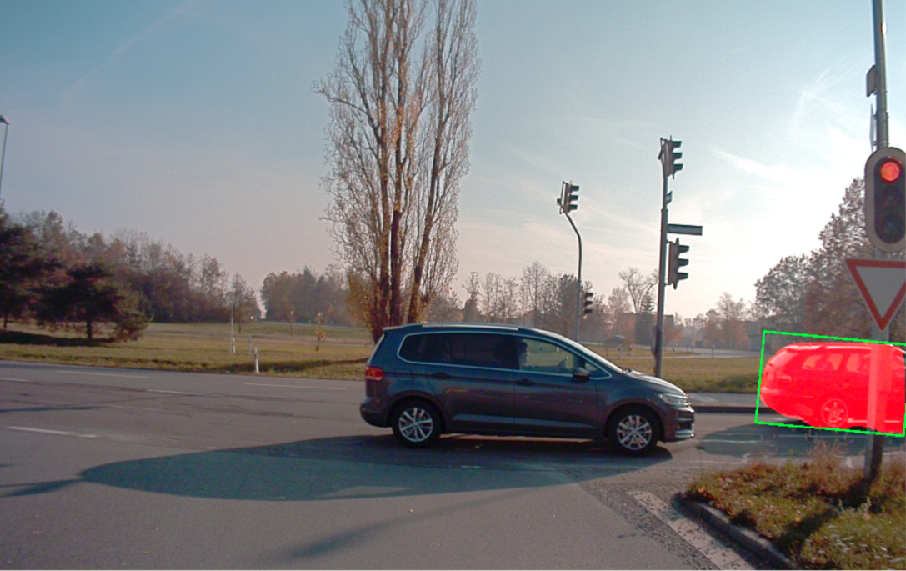
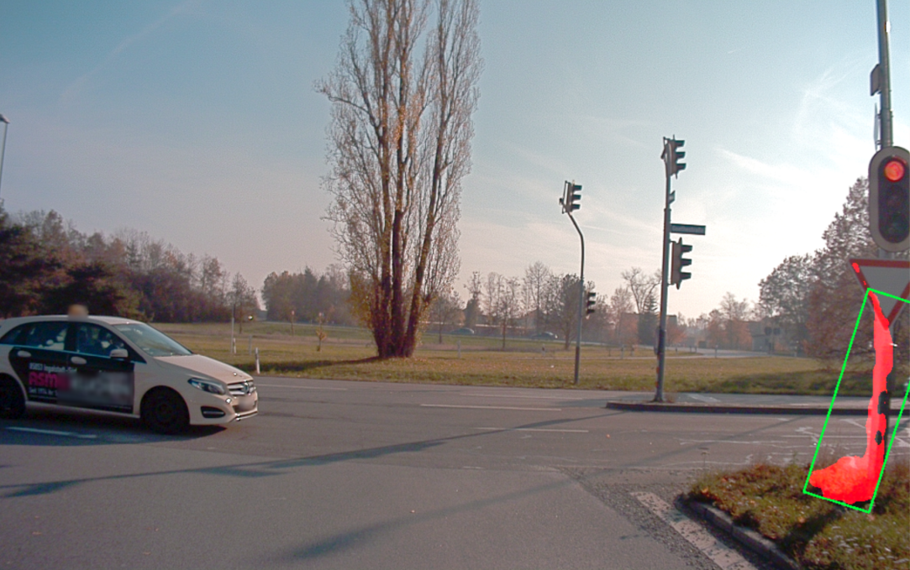

# Evalutating Single Object Tracking For Autonomous Driving

  

In this project, I applied and evaluated Single Object Tracking by using the object tracking system [SiamMask](https://github.com/foolwood/SiamMask) on the autonomous driving datasets [A2D2](https://www.a2d2.audi/a2d2/en.html) and [KITTI](http://www.cvlibs.net/datasets/kitti/).

Detailed description following soon!

How to use the GUI: 

python GUI.py --config "../SiamMask/experiments/siammask_sharp/config_davis.json" --resume "../SiamMask/experiments/siammask_sharp/SiamMask_DAVIS.pth" --dataset "path/to/dataset" --object_lookup "path/to/lookup"
