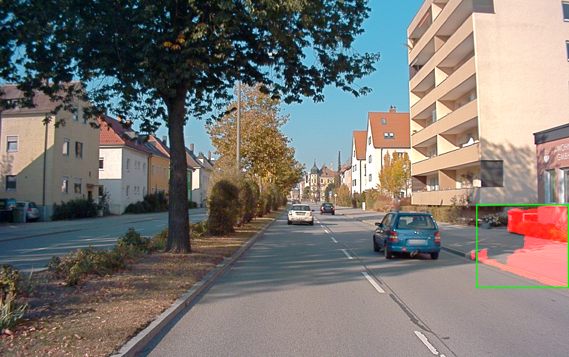

# Evalutating Single Object Tracking For Autonomous Driving

In this project, I applied and evaluated Single Object Tracking by using the object tracking system [SiamMask](https://github.com/foolwood/SiamMask) on the Audi Autonomous Driving Dataset [A2D2](https://www.a2d2.audi/a2d2/en.html) and [KITTI](http://www.cvlibs.net/datasets/kitti/).
The goal was to test, how applicable SiamMask to the task of tracking individual vehicles in those datasets without explicitly fine-tuning it.

The tracker can be evaluated by using the semantic segmentations and instance segmentations: 

  

However, in the A2D2, only a subset of the video frames is annotated with segmentations, which leads to following fail cases: 

  
  

For details see the whole [report](Kiegeland_Project_Report.pdf)

How to use the GUI: 

python GUI.py --config "../SiamMask/experiments/siammask_sharp/config_davis.json" --resume "../SiamMask/experiments/siammask_sharp/SiamMask_DAVIS.pth" --dataset "path/to/dataset" --object_lookup "path/to/lookup"
